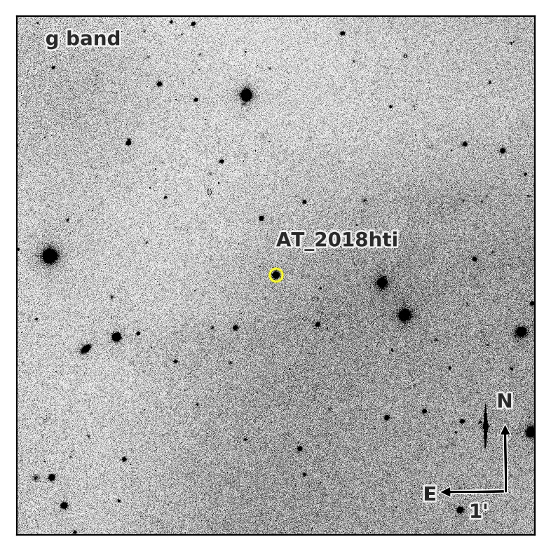

## Finder Maker

Can be ran interactively without any flags

```
python make_finder.py
```

Or non-interactively with the ```not``` flag:

```
python make_finder.py not
```

If running non-interactively, execuse a function as the one below:

```python
create_finder(aperture_size_pix, image_radius_pix, arrow_size_wcs, image_upper_std, image_lower_std, '11:50:58.0924', '10:23:35.5934', 'ZTF18adbyxua', 'g', instructions, interactive = False, image_name = 'ZTF18adbyxua.fits', do_tde = 'y', do_detection = 'y')
```

The result will be an image like this:
<p align="center"></p>
Additional instructions can be added to the xlabel

# Future updates
- support for 3PI .fits image query.
- Ability to mark offset stars.
